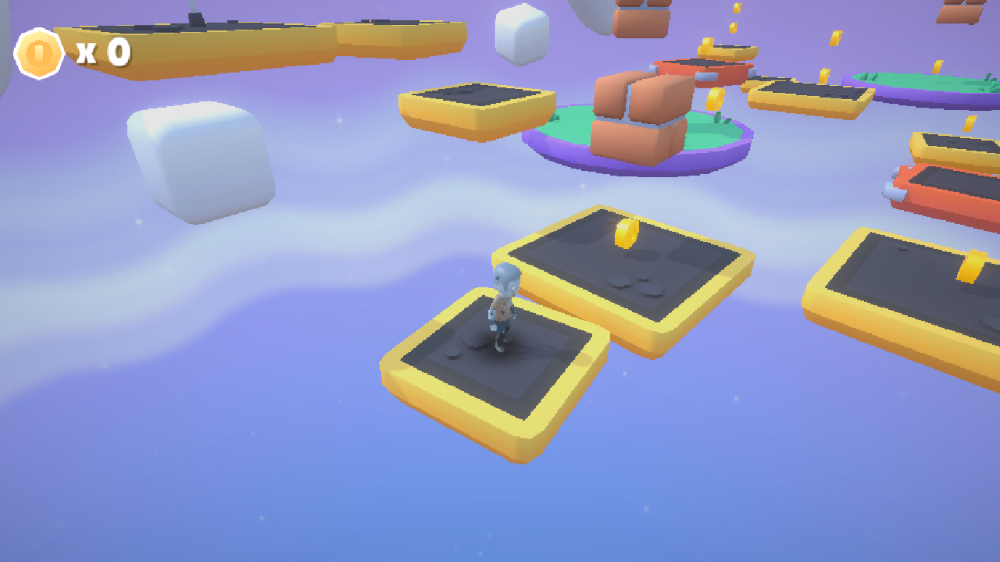

# 從下載模型到可以玩的角色

這次示範使用 [Kenney Animated Characters Survivors](https://kenney.nl/assets/animated-characters-survivors)。目標是先做出 `ZombieCharacter.prefab`，再替換 Player 的外觀。角色移動、碰撞與二段跳繼續由原本的 Player 控制。

## 1. 下載與挑選檔案

在素材頁按 Download，再選 Continue without donating，解壓縮。這次使用：

| ZIP 裡的位置 | 專案裡的位置 |
|---|---|
| `Model/characterMedium.fbx` | `Assets/NewCharacter/characterMedium.fbx` |
| `Animations/idle.fbx` | `Assets/NewCharacter/idle.fbx` |
| `Animations/run.fbx` | `Assets/NewCharacter/run.fbx` |
| `Animations/jump.fbx` | `Assets/NewCharacter/jump.fbx` |
| `Skins/zombieA.png` | `Assets/NewCharacter/zombieA.png` |
| `License.txt` | `Assets/NewCharacter/License.txt` |

把它們拖到 Unity Project 視窗的 `Assets/NewCharacter`。這份下載是 FBX 模型、動畫和貼圖，還不是已經接上遊戲的 Unity Prefab。

素材為 CC0。本次重新下載的 ZIP SHA-256：`fdadced07a0454c9b7f0b46507be6144a072b4d03b4ffa37f225893c76c62845`；上述模型、動畫、貼圖與原先換皮檔案逐一比較，內容相同。網站日後可能更新檔案。

## 2. 在匯入設定先處理尺寸、骨架與動畫

選取 `characterMedium.fbx`，先改 Model 分頁並按 Apply，再設定 Rig／Avatar。Idle、Run、Jump 也使用相同的 Model／Rig 設定。從下載的原始 FBX 開始，能讓 Avatar 按整理後的尺寸建立；已有 Avatar 時要重新檢查映射與預覽，不能只確認綠色有效標記。

| 分頁 | 設定 | 這次使用的值／目的 |
|---|---|---|
| Model | Scale Factor | `0.28`：符合現有約一公尺高的玩家；其他模型要依實際大小調整 |
| Model | Convert Units | 開啟：使用 FBX 的單位換算 |
| Model | Bake Axis Conversion | 開啟：把座標軸轉換套到模型與動畫資料 |
| Rig | Animation Type | Humanoid |
| Rig | Avatar Definition | Create From This Model；確認 Configure 的骨骼映射有效 |
| Animation | Remove Constant Scale Curves | 開啟：移除與初始縮放相同的常數曲線；不是刪除所有縮放動畫 |

在三個動畫 FBX 的 Animation 分頁：

- 移除 `Root|0.Targeting Pose`，每個檔案只留下 `Root|Idle`、`Root|Run` 或 `Root|Jump`。
- Idle、Run 開啟 Loop Time；Jump 關閉。
- Root Transform Rotation 開啟 Bake Into Pose，Based Upon 選 Original。
- Root Transform Position 的 Y、XZ 開啟 Bake Into Pose，Based Upon 選 Original。

本遊戲的升降與水平移動由 CharacterController 驅動，所以 Animator 不使用 Apply Root Motion。需要由動畫推動角色的遊戲，這些 Root Motion 設定要另外設計。

先預覽三個動畫：不能是靜止的 Targeting Pose，也不能播放後突然放大。Humanoid 與有效 Avatar 是這包素材的做法；其他模型若無法建立 Humanoid Avatar，需要相容骨架的 Generic 動畫。

參考：[Kenney 作者的匯入步驟](https://kenney.nl/knowledge-base/game-assets-3d/importing-characters-and-animations)、[Unity 模型匯入設定](https://docs.unity3d.com/6000.6/Documentation/Manual/FBXImporter-Model.html)。

## 3. 把模型組成可直接用的角色 Prefab

在 Hierarchy 建立空物件 `ZombieCharacter`，Transform 為 Position 0、Rotation 0、Scale 1。將 `characterMedium.fbx` 拖到它底下：

```text
ZombieCharacter                 ← 遊戲效果作用在這層
└ characterMedium               ← 模型、骨架、Animator
```

子模型 Position 設為 0、Scale 設為 1。這個 Kenney 模型的腳尖原本朝 −Z，所以子模型 Rotation Y 設為 **180°**，讓準備好的角色朝 +Z。這是保存在 Prefab 的素材修正；不要在 Player.cs 開場再旋轉它。Bake Axis Conversion 處理座標系統，不能替你判斷人物臉朝哪邊。

建立 `ZombieSkin.mat`，Shader 使用 `Universal Render Pipeline/Lit`，Base Map 指定 `zombieA.png`，Base Color 為白色；拖到子模型的 Skinned Mesh Renderer。

在子模型的 Animator：

- Avatar 使用模型匯入產生的有效 Avatar。
- 先在 Project 視窗複製 `Assets/Art/Animation/CharacterAnimatorController.controller`，保存為 `Assets/NewCharacter/ZombieAnimatorController.controller`，再指定這份角色專用的 Controller。
- 關閉 Apply Root Motion。

打開這份複製的 Controller，在 Locomotion Blend Tree 保留原本的 Speed 門檻，把三個 Motion 設為 Idle、Run、Run；Jump 狀態設為 Jump。保留原有 `Speed`／`Grounded` 參數與轉場條件，Player.cs 會更新它們。兩條轉場的 **Has Exit Time 關閉**，讓起跳與落地直接響應 Grounded，避免等待走路／待機動畫播到指定位置才跳。

把整個 `ZombieCharacter` 拖到 Project 視窗，保存為 `Assets/NewCharacter/ZombieCharacter.prefab`。它的外層 Transform 是 0／0／1，材質、Animator 與朝向已接好。

## 4. 替換 Player 的外觀

先停止 Play Mode，打開 `Assets/Prefabs/Player.prefab`：

1. 把 `ZombieCharacter.prefab` 拖到 Player 底下，命名為 `character`，Position 0、Rotation 0、Scale 1。
2. Player 元件的 **Model** 指定新的 `character` 外層。
3. **Animator** 指定新角色子模型上的 Animator。
4. 確認引用已改好，再移除舊角色子物件，儲存 Player Prefab。

```text
Player                          ← Player.cs、CharacterController
├ character                     ← 已準備好的 ZombieCharacter Prefab
│ └ characterMedium              ← Animator、骨架、模型
├ DustParticles
└ 其他原有音效／效果物件
```

保留 Player 的移動、Input Actions、碰撞膠囊與效果引用。新角色與舊角色大小接近時，可以沿用膠囊；換成不同身形時，要在 Scene 視窗確認高度、半徑和腳底接地。

Player.cs 只記住 Model 初始大小，跳躍／落地相對這個大小拉伸、再恢復。它不再修正模型朝向。獨立外層也讓骨架動畫與跳躍變形作用在不同物件上。

## 5. 現場驗證



在 Main 場景按 Play：站立、WASD 跑步、轉向、二段跳、落地，再收一枚 Coin。觀察臉和腳尖是否朝移動方向、角色是否接地、動畫是否切換、跳躍後是否恢復原大小、HUD 是否加分，最後看 Console。

示範可以分成約五分鐘：下載與選檔一分鐘、匯入設定與動畫預覽兩分鐘、材質和 Prefab 一分鐘、換皮與實玩一分鐘。

## 已有 Unity Prefab 時

先確認來源專案要求的 Unity 版本、Render Pipeline 與依賴，再匯入它的 `.unitypackage`／必要資產。拖到場景檢查材質、尺寸、朝向、Animator 和 Avatar；來源角色附帶的移動腳本、Collider、Rigidbody 不要與本專案的 Player 重複控制。挑出可用的視覺角色，按上面的第 3、4 步整合。不同骨架不能只換 Mesh 就保證沿用全部動畫。

## 重做這個範例的 Editor 工具

上面是示範用的手動流程。專案另有兩個選單，對固定的 Kenney 檔案重做相同設定：

- `Tools > Character Workshop > 1 Prepare Zombie Prefab`：處理匯入、動畫、材質，保存角色 Prefab。
- `Tools > Character Workshop > 2 Apply Prepared Zombie To Player`：把已準備好的角色接到 Player。

兩步都要停止 Play Mode；套用前先關閉 Player 的 Prefab Mode。工具會更新這個範例的匯入設定、角色 Prefab 與角色專用 Animator Controller，保留原本的 Controller，並重建這包素材的自動 Avatar 映射；再次執行會重新套用這些固定值。它不下載檔案、不刪除舊素材，也不把任何「整理模型」工作放到遊戲執行時。

可選的本機回歸檢查（需要已安裝的 Unity Pipeline／CLI）：

```sh
unity command --project-path /path/to/project run_script --file Tests/CharacterSmoke.cs --entry CharacterSmoke.Main
```

請在 Main 的 Play Mode、Game view 有 focus 時執行。測試以固定 1/60 秒步長檢查同一份 Player 更新邏輯，不依賴 Editor 當下幀率，也不保存場景。
